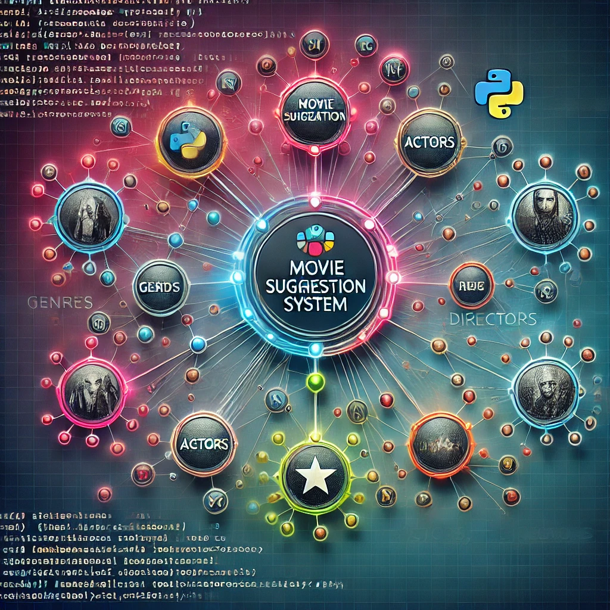
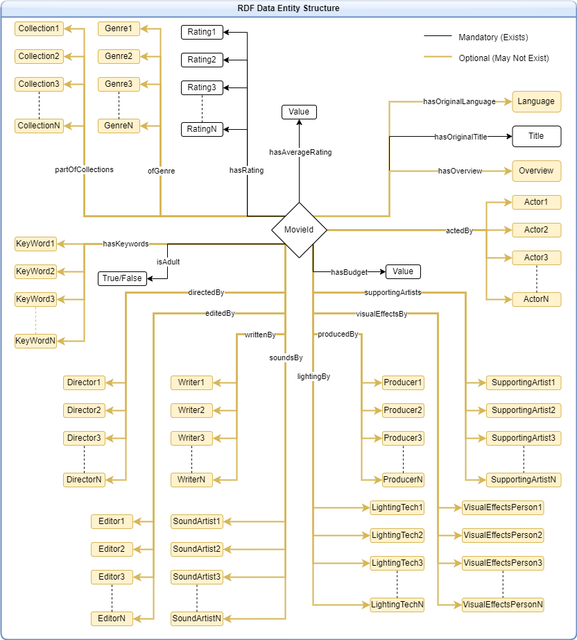

# KR-Project
This project tries to create a movie recommendation system using Knowledge Graphs using the parameters of the movies the user is currently viewing.

## Data Source
The data is loaded from a kaggle dataset named [The Movies Dataset by Rounakbanik](https://www.kaggle.com/datasets/rounakbanik/the-movies-dataset) that offers extensive movie data as multiple CSV files

## Data Conversion
The CSV files loaded from kaggle are first converted to RDF files since the project requires that the graph be presented as an application on an RDF Database.
The [`data_converter.py`](./data_converter.py) is used to convert the data
The converted data can be found as [`MovieData.rdf`](./dataset_processed/MovieData.rdf)

## Log Files
The [outputLogs](./outputLogs/) folder contains files that are meant to log the progess of each python file. This can be used for debugging and reference. This log file is cleared first when each program is run so it only contains logs of that session in them, all of which are time-tagged.
Additionally, the files with the name **Output** in them like [converterOutput.txt](./converterOutput.txt) are terminal logs. They contain outputs from the terminal routed to them.

## RDF Structure
The processed data is saved in RDF Dataset format with each entity having the below expected structure : 

## Queries
The Queries to be run to attain each data from the RDF database is described in the [`queries.py`](./queries.py) script. These queries can be individually tested using the [`queryTester.py`](./queryTester.py) script instead of trying it out on the live version. 
To test each query, alter the sparql_query parameter value in line 25 of the [`queryTester.py`](./queryTester.py) script to whatever your query variable name is (as declared in the [`queries.py`](./queries.py) file).
The referenced line 25 is as follows : 
`query_rdf_file(rdf_file=rdfFile, sparql_query=example_query)`

## Constants
All constant values used throughout the project, such as path to files, Keys used for predicates, Keys used in response JSON data, parameter enums, etc are available in the [`constants.py`](./constants.py) file.
These values are meant to not be changed and kept constant throughout the entire funcioning.

## Controllers
All functions that are required to run queries based on input values is written in the file [`controllers.py`](./controllers.py). All necessary handlers such as type castings, error handlers, return type alterations, data filtering, sorting, all happens within the functions defined in this folder and provides additional layer of safety to the back-end.
The functions here 
- take the input passed by the user
- process it if necessary
- run queries related to each input
- order/filter/merge response data
- convert the data to json
- return resulting data.