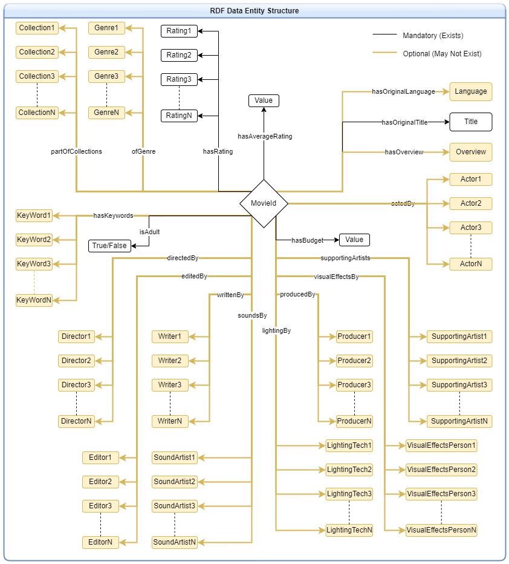

# KR-Project
This project tries to create a movie recommendation system using Knowledge Graphs using the parameters of the movies the user is currently viewing.

## Data Source
The data is loaded from a kaggle dataset named [The Movies Dataset by Rounakbanik](https://www.kaggle.com/datasets/rounakbanik/the-movies-dataset) that offers extensive movie data as multiple CSV files

## Data Conversion
The CSV files loaded from kaggle are first converted to RDF files since the project requires that the graph be presented as an application on an RDF Database.
The [`data_converter.py`](./data_converter.py) is used to convert the data

## RDF Structure
The processed data is planned to be in RDF Dataset format with each entity having the below expected structure : 
