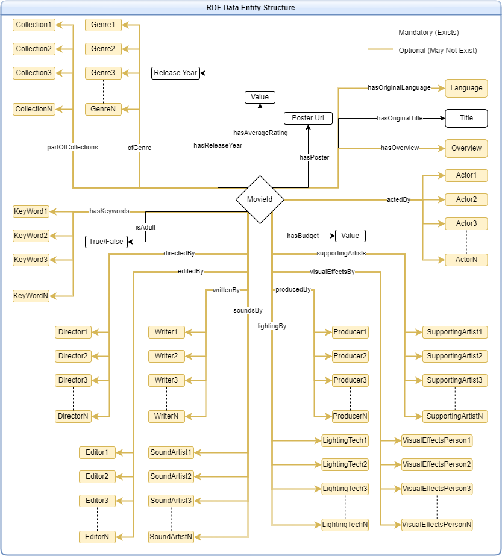

# KR-Project
This project tries to create a movie recommendation system using Knowledge Graphs using the parameters of the movies the user is currently viewing.

## Data Source
The ontology was inspired from a 11 year old github repository regarding a movies project. But the data populated in the directory was dummy data with unreliable connections between the values so the ontology of that project was populated with IMDB movie data from 3 different kaggle datasets to fill all the predicates.

The data is loaded from a kaggle dataset named [The Movies Dataset by Rounakbanik](https://www.kaggle.com/datasets/rounakbanik/the-movies-dataset) that offers extensive movie data as multiple CSV files. Additional data was fetched from 2 other datasets from kaggle to fill the values according to the initial ontology. The [second dataset](https://www.kaggle.com/datasets/asaniczka/tmdb-movies-dataset-2023-930k-movies) was used for Year of Release and the [third dataset](https://www.kaggle.com/datasets/harshitshankhdhar/imdb-dataset-of-top-1000-movies-and-tv-shows) was used for Movie Poster Urls.

## Data Conversion
The CSV files loaded from kaggle are first converted to RDF files since the project requires that the graph be presented as an application on an RDF Database.
The [`data_converter.py`](./data_converter.py) is used to convert the data
The converted data can be found as [`MovieData.rdf`](./dataset_processed/MovieData.rdf)

## Log Files
The [outputLogs](./outputLogs/) folder contains files that are meant to log the progess of each python file. This can be used for debugging and reference. This log file is cleared first when each program is run so it only contains logs of that session in them, all of which are time-tagged.
Additionally, the files with the name **Output** in them like [converterOutput.txt](./converterOutput.txt) are terminal logs. They contain outputs from the terminal routed to them.

## RDF Structure
The processed data is saved in RDF Dataset format with each entity having the below expected structure : 

## Queries
The Queries to be run to attain each data from the RDF database is described in the [`queries.py`](./queries.py) script. These queries can be individually tested using the [`queryTester.py`](./queryTester.py) script instead of trying it out on the live version. 
To test each query, alter the sparql_query parameter value in line 47 of the [`queryTester.py`](./queryTester.py) script to whatever your query variable name is (as declared in the [`queries.py`](./queries.py) file).
The referenced line 47 is as follows : 
`query_rdf_file(rdf_file=rdfFile, sparql_query=example_query)`

## Constants
All constant values used throughout the project, such as path to files, Keys used for predicates, Keys used in response JSON data, parameter enums, etc are available in the [`constants.py`](./constants.py) file.
These values are meant to not be changed and kept constant throughout the entire funcioning.

## Controllers
All functions that are required to run queries based on input values is written in the file [`controllers.py`](./controllers.py). All necessary handlers such as type castings, error handlers, return type alterations, data filtering, sorting, all happens within the functions defined in this folder and provides additional layer of safety to the back-end.
The functions here 
- take the input passed by the user
- process it if necessary
- run queries related to each input
- order/filter/merge response data
- convert the data to json
- return resulting data.

## API End Points
All API endpoints have been declared in the [`endpoint.py`](./endpoint.py) file and can be run using the code `python endpoint.py`.
The endpoints are created using FastAPI and logging has been added so that every call would add logs to the log file [`backendLogs.txt`](./outputLogs/backendLogs.txt). The log file only gets updated after the program is closed so it would be a post-completion log rather than a live log. The live log is available on the terminal when running the file.
Additionally, all IP Address and Port related settings have been scripted directly into the endpoint file and needn't be inferred or mentioned when running it.

## Web Page
Two Pages have been Set Up:
- [`index.html`](./website/index.html) : This page contains a search area to search for movies within the database. The results of the search is presented as a clickable grid. The page has been set up in basic HTML with CSS script written in [`home.css`](./website/home.css) used to style the page. All API calls and other functions have been written as JS functions within the script tag of the HTML file.
- [`movieDetails.html`](./website/movieDetails.html) : This page contains additional details about the movie that has been clicked from the search results. It shows all available movie details in an aesthetic format and additionally provides suggestions to similar movies from the same genre, same category, with similar cast and such. The page has been set up in basic HTML with CSS script written in [`movieDetails.css`](./website/movieDetails.css) used to style the page. All API calls and other functions have been written as JS functions within the script tag of the HTML file.

## Project Structure
A Basic layour or structure of the project has been developed to represent the flow of control throughout the project and how each value from each file is used in itself or in other files.

## Deployment
The project backend has been deployed as a FastApi instance to a free hosting page called Railway. The HTML pages along with their CSS counterparts have been declared as API endpoints in the backend python file and is called accordingly, but for the user, presents as a HTML hosted page. 
The URLs for the project is given below and has been disabled on 17 Jan 2025 : 
- [`API Calls`](https://kr-project-production.up.railway.app/docs)
- [`Home Page`](https://kr-project-production.up.railway.app/index.html)

## Finale
This project uses an RDF schema and provides an insight as to how graph databases can be used as a primitive alternative to Artificial Intelligence Models if the queries are designed and optimised well enough. There seem to be various limitations to the time it takes for queries to run as the dataset gets larger, but to a certain extent, this method would be a considerable alternative to AI models. 